# Microsoft Power Automate Hands-on Lab

## ProcessInvoice Flow with AI Builder

---

## Prerequisites

- Microsoft 365 account with Power Automate and AI Builder licences
- Access to a SharePoint site where you can create a document library and a list
- AI Builder credits enabled in your environme5. Click on the run to see each step's output.
- Sample invoice PDF files for testing
- Permissions to create and edit flows, SharePoint lists, and libraries

---

## Step 1: Prepare SharePoint

If you are using the pre-created <company> playground, navigate to your SharePoint playground site's Payments list. If you are creating your own then navigate to your SharePoint home page.

### 1.1 Create a Document Library

1. Open your browser and go to your SharePoint site.
2. In the left navigation, click **Home**.
3. At the top, click **+ New** > **Document library**.
4. Choose Blank library
5. In the "Name" box, type: `Invoices`
   > **💡 Tip:** To ensure your library has a unique name in a shared environment, prefix it with your initials. For example, if your name is John Smith, use `JS_Invoices`.
6. Click **Create**.

**Invoices Document Library**
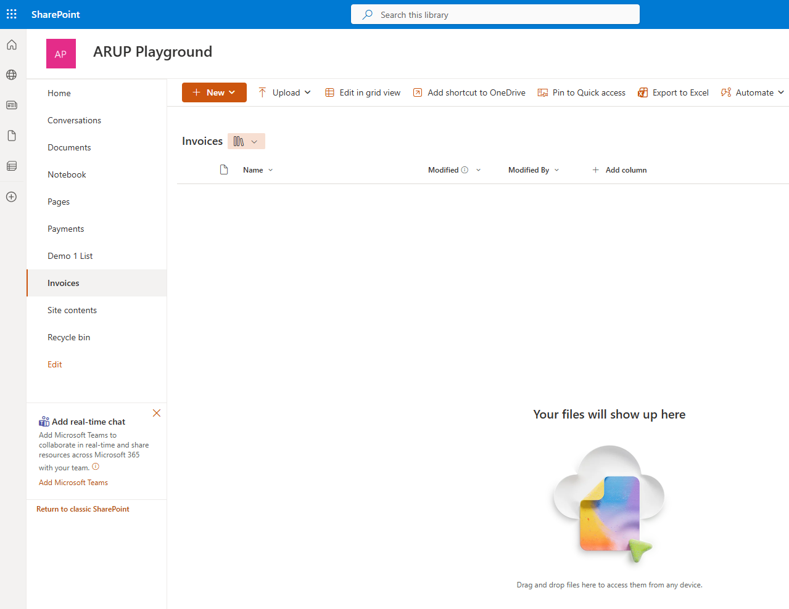

### 1.2 Create a SharePoint List

1. On your SharePoint site, click **Site contents** in the left navigation.
2. Click **+ New** > **List**.
3. Click **Blank list**.
4. In the "Name" box, type: `Payments` (or `ProcessedInvoices` - you can choose either name)
   > **💡 Tip:** To ensure your list has a unique name in a shared environment, prefix it with your initials. For example, if your name is John Smith, use `JS_Payments` or `JS_ProcessedInvoices`.
5. Click **Create**.
6. Add the following columns to the list:
   - **Vendor** (Text)
   - **Invoice Number** (Text)
   - **Product** (Text)
   - **Net Amount** (Number)
   - **VAT Amount** (Number)
   - **Gross Amount** (Number)
   - **Due Date** (Date and Time)
   - **Payment Status** (Text)
7. Click **Save** after each column.

**Adding a New Column**
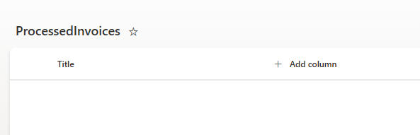

**Completed Columns**
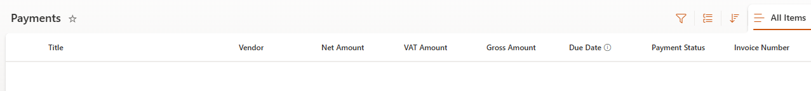

## Step 2: Create the ProcessInvoice Flow

### 2.1 Start a New Flow

1. Open your browser and go to https://make.powerautomate.com.
2. On the left, click **Create**.
3. Under "Start from blank", click **Automated cloud flow**.
4. In the "Flow name" box, type: `ProcessInvoice`
   > **💡 Tip:** To ensure your flow has a unique name in a shared environment, prefix it with your initials. For example, if your name is John Smith, use `JS_ProcessInvoice`.
5. In "Choose your flow's trigger", search for:  
   `When a file is created (properties only)`
6. Click on the trigger called **When a file is created (properties only) [SharePoint]**.
7. Click **Create**.

**Build an Automated Cloud Flow**
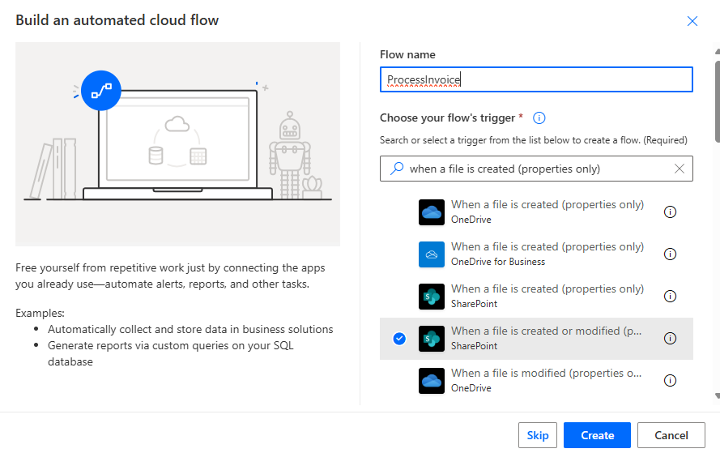

### 2.2 Configure the SharePoint Trigger

1. Click on the When a file is created or modified (properties only) trigger in the editor
2. In the **Site Address** dropdown, select or enter your SharePoint site (e.g., "<company> Playground").
3. In the **Library Name** dropdown, select **Invoices** or the name of the document library you created in step 1.1. If using the standard one, choose **Documents**.
4. Leave the rest of the settings as default.

**Configure the SharePoint Trigger**


### 2.3 Add "Get file content" Action

1. Click **+ New step** or + in a circle, if using the New designer
2. In the search box, type: `Get file content`
3. Select **Get file content [SharePoint]**.
4. In **Site Address**, select your SharePoint site (same as before).
5. In **File Identifier**, click in the box, click the lightning bolt then select **Identifier** from the Dynamic content list (it appears with a SharePoint icon). You will need to click See more(48) to show the field.

**Select Identifier**
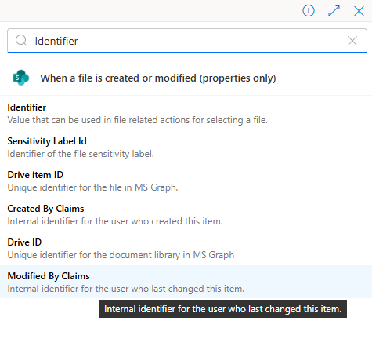

**Get File Content Configured**
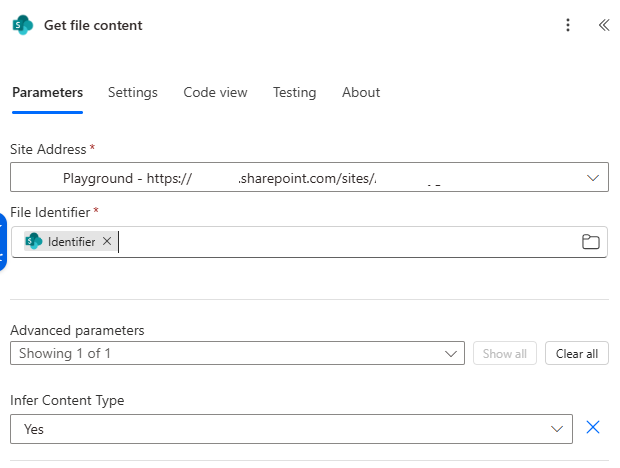

### 2.4 Add "Process invoices" (AI Builder) Action

1. Click **+ New step** or + in a circle, if using the New designer.
2. In the search box, type: `Process Invoices`
3. Select **Process Invoices** (AI Builder).
4. In **Invoice file**, click in the box, then select **File content** from the Dynamic content list (from the previous "Get file content" step).

**Select File Content**
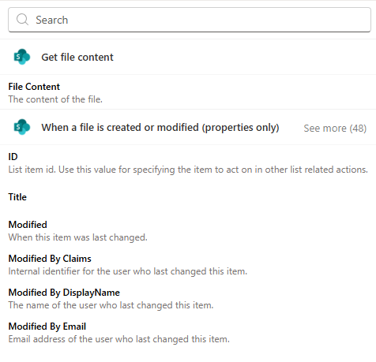

**Process Invoices Configured**
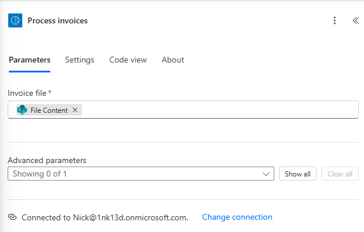

### 2.5 Initialize Variables

For each variable below, follow these steps:

1. Click **+ New step** or + in a circle, if using the New designer.
2. In the search box, type: `Initialize variable`
3. Select **Initialize variable**.
4. In **Name**, type the variable name (see table below).
5. In **Type**, select the correct type (see table below).
6. In **Value**, select the dynamic content or leave blank as specified (see table below).

**Create these six variables in order:**

| Variable # | Name          | Type   | Value                                                                         |
| ---------- | ------------- | ------ | ----------------------------------------------------------------------------- |
| 1          | Vendor        | String | From Dynamic content, select **Vendor name** (from the Process invoices step) |
| 2          | InvoiceNumber | String | From Dynamic content, select **Invoice ID** (from the Process invoices step)  |
| 3          | Product       | String | (leave blank)                                                                 |
| 4          | NetAmount     | Float  | (leave blank)                                                                 |
| 5          | VATAmount     | Float  | (leave blank)                                                                 |
| 6          | LineItem      | String | (leave blank)                                                                 |

**Tips:**

- For variables 1 and 2: Click in the **Value** field, then click the lightning bolt icon to open Dynamic content. Search for "Vendor name" or "Invoice ID" and select them.
- For variables 3-6: Leave the **Value** field completely empty.
- You can optionally rename the actions to make them clearer (e.g., "Init Vendor", "Initialize Invoice ID", etc.) but this is not required.

**Select Vendor Name**
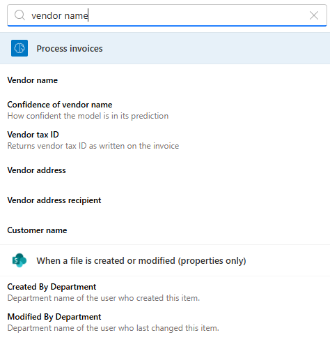

**Completed Variables**
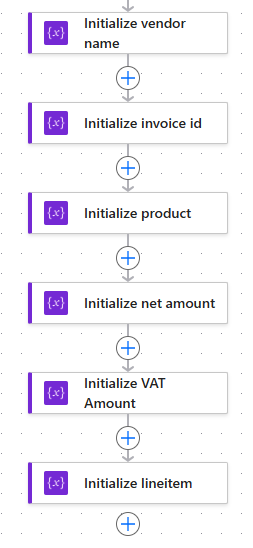

### 2.6 Add "Apply to each" Control for Line Items

1. Click **+ New step** or + in a circle, if using the New designer.
2. In the search box, type: `Apply to each`
3. Select **Apply to each**.
4. In **Select an output from previous steps**, click in the box, then click the Dynamic content icon and select **items** from the **Process invoices** step.
   - You may need to scroll through the dynamic content to find this field under the Process invoices action.

**Choose Items for Loop**
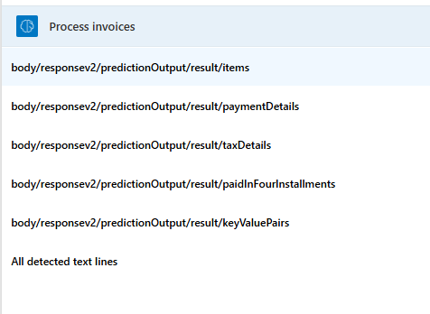

#### Inside the "Apply to each" loop, add three actions:

**a. Set LineItem Variable**

1. Click **Add an action** inside the loop.
2. Search for **Set variable**.
3. Select **Set variable**.
4. In **Name**, select **LineItem** from the dropdown.
5. In **Value**, click in the field, then open Dynamic content and select **Line item description** (this appears under the "Process invoices" section in the Apply to each loop). Search for description.

**b. Run Product Prompt (AI Builder Custom Prompt)**

1. Click **Add an action**.
2. Search for **Run a prompt**.
3. Select **Run a prompt** (AI Builder).
4. In the **Prompt** dropdown, click **New custom prompt** at the top of the list.

   **Step 1: Create the ProcessLineItem Prompt**

   - A new prompt designer window will open.
   - At the top, enter the prompt name: `ProcessLineItem` - This name will need to unique in your environment. So if you get an error while saving, try changing the name
   - In the **Instructions** section, enter:
     ```
     Give me the product and the price for the following line item: {{Products}}
     ```
   - Click **Add content** (the + button) to add the input parameter.
   - In the popup, set:
     - **Name**: `Products`
     - **Sample data**: `Handled Golf GPS Rate: $120.12` (or any example line item)
   - Click **Close**.
   - In the Instructions, replace {{Products}} with your content you added by highlighting the text and typing "/" and choose Products. 
   - In the **Model response** section on the right, you'll see "Your test results will appear here."
   - You can test your prompt by clicking **Test** (optional). If you test, you should see something like:
     {
     "product": "Handled Golf GPS Rate",
     "price": 120.12
     }
   - At the bottom right, click **Save**.
   - Close the prompt designer window/tab.

5. Back in the flow, **ProcessLineItem** should now be selected in the **Prompt** dropdown.
6. Rename this action to **Run Product Prompt** for clarity by clicking the three dots (...) and selecting **Rename**.
7. In the **Products** field, click in the box and select the **LineItem** variable from Dynamic content.

**Completed ProcessLineItem Prompt**
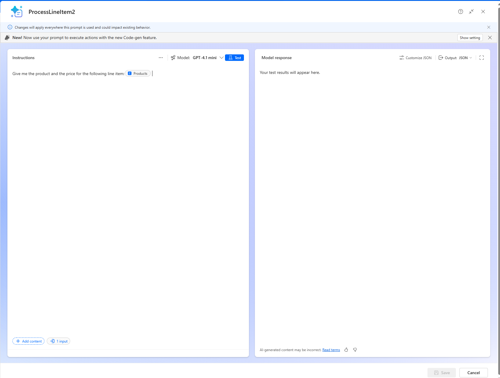

**c. Append to Products**

1. Click **Add an action**.
2. Search for **Append to string variable**.
3. Select **Append to string variable**.
4. In **Name**, select **Product** from the dropdown.
5. In **Value**, click in the field, then open Dynamic content and select **product** (from the "Run Product Prompt" step).
   - Look for this under the Run Product Prompt action outputs.

**Completed Append to Products String**
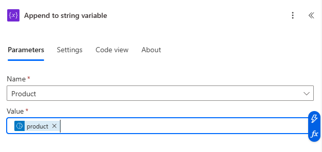

**Completed Apply to Each**
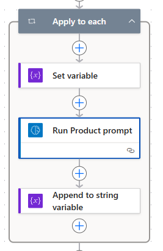

#### Outside the "Apply to each" loop, add the following actions:

### 2.7 Run Invoice Title Prompt (AI Builder Custom Prompt)

1. After the loop, click **+ New step** or + in a circle, if using the New designer.
2. Search for **Run a prompt**.
3. Select **Run a prompt** (AI Builder).
4. In the **Prompt** dropdown, click **New custom prompt** at the top of the list.

   **Step 1: Create the InvoiceTitle Prompt**

   - A new prompt designer window will open.
   - At the top, enter the prompt name: `InvoiceTitle`
   - In the **Instructions** section, enter:

     ```
     Summarise these products into a single category for the purposes of an invoice title {{Products}} . Output only the category.
     ```

   - Click **Add content** (the + button) to add the input parameter.
   - In the popup, set:
     - **Name**: `Products`
     - **Sample data**: `Handled Golf GPS Golf cart - black` (or any example product list)
   - Click **Close**.
   - In the Instructions, replace {{Products}} with your content you added by highlighting the text and typing "/" and choose Products. 
   - In the **Model response** section on the right, you'll see "Your test results will appear here."
   - Change output to JSON
   - You can test your prompt by clicking **Test** (optional).
   - At the bottom right, click **Save**.
   - Close the prompt designer window/tab.

5. Back in the flow, **InvoiceTitle** should now be selected in the **Prompt** dropdown.
6. Rename this action to **Run InvoiceTitle Prompt** for clarity by clicking the three dots (...) and selecting **Rename**.
7. In the **Products** field, click in the box and select the **Product** variable from Dynamic content.

**Completed InvoiceTitle Prompt**
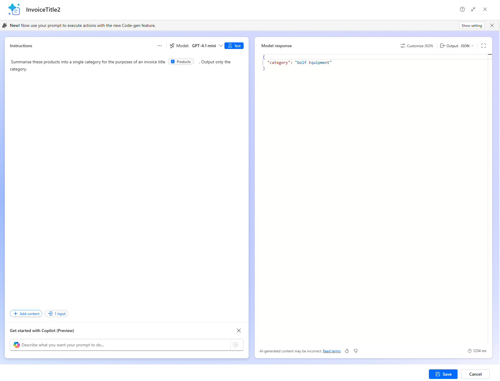

### 2.8 Set Product Variable

1. Click **+ New step** or + in a circle, if using the New designer.
2. Search for **Set variable**.
3. Select **Set variable**.
4. In **Name**, select **Product** from the dropdown.
5. In **Value**, click in the field, then open Dynamic content and select **category** (from the "Run InvoiceTitle Prompt" step).

**Completed Set Product**
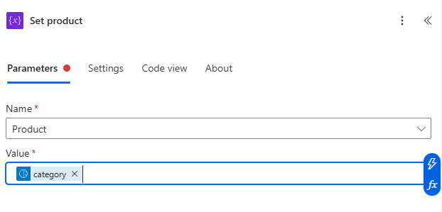

### 2.9 Set NetAmount Variable

1. Click **+ New step** or + in a circle, if using the New designer.
2. Search for **Set variable**.
3. Select **Set variable**.
4. In **Name**, select **NetAmount** from the dropdown.
5. In **Value**, click in the field, then open Dynamic content and select **Subtotal (number)** (from the "Process invoices" step).

**Completed NetAmount**
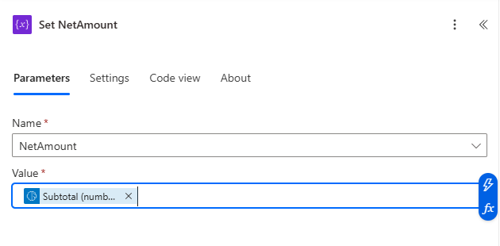

### 2.10 Create Item in SharePoint List

1. Click **+ New step** or + in a circle, if using the New designer.
2. In the search box, type: `Create item`
3. Select **Create item [SharePoint]**.
4. In **Site Address**, select your SharePoint site (same as before).
5. In **List Name**, select your list (e.g., **Payments** or **ProcessedInvoices** - whichever list you created in Step 1.2).
6. Click **Show all** under "Advanced parameters" to see all available fields.

**Selecting a Field from Variables**
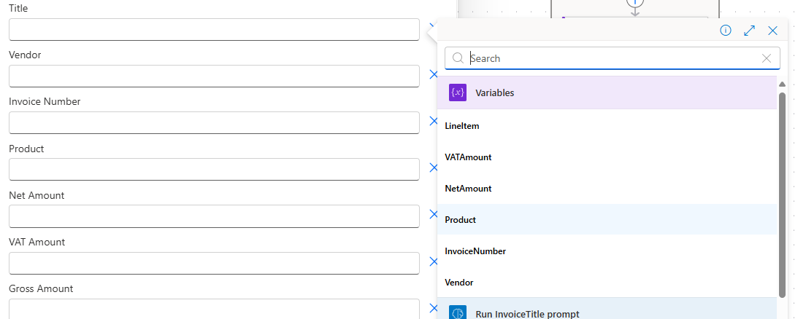

7. Map the following fields by clicking in each field and selecting from Dynamic content:

| SharePoint Field | Value to Select from Dynamic Content               | Source                |
| ---------------- | -------------------------------------------------- | --------------------- |
| Title            | **Product** (variable)                             | Variables             |
| Vendor           | **Vendor** (variable)                              | Variables             |
| Net Amount       | **NetAmount** (variable)                           | Variables             |
| VAT Amount       | **Total tax (number)** (from Process invoices)     | Process invoices step |
| Gross Amount     | **Invoice total (number)** (from Process invoices) | Process invoices step |
| Due Date         | **Due date (text)** (from Process invoices)        | Process invoices step |
| Payment Status   | Type: **Pending** (manually type this text)        | Manual entry          |
| Invoice Number   | **InvoiceNumber** (variable)                       | Variables             |

**Completed Create Item in SharePoint**
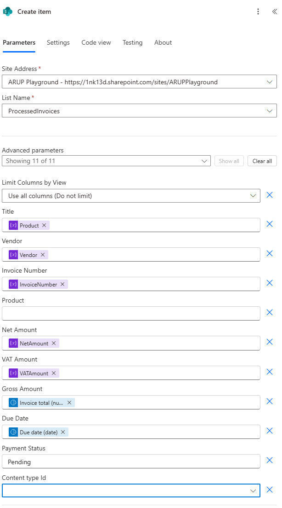

## Step 3: Save and Test the Flow

1. In the top right, click **Save**.
2. In a new browser tab, go to your SharePoint site and upload a sample invoice PDF to the **Documents** library (or **Invoices** if you created a custom library).
   - **Note:** Sample invoice PDFs are available in this repository that you can use for testing.
3. Return to Power Automate and watch the flow run.
4. Click on the run to see each step's output.
5. Go to your SharePoint list (e.g., **Payments** or **ProcessedInvoices**) and verify a new item has been created with the extracted invoice data.

**Processed Invoices in the List**
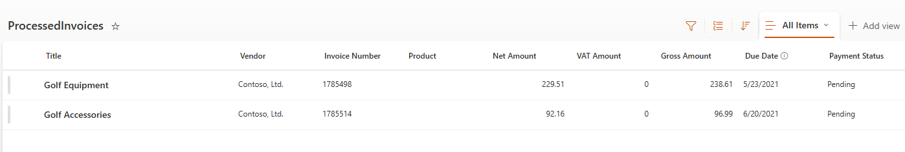

## Troubleshooting

### Common Issues and Solutions

#### **Issue: Flow Doesn't Trigger When Uploading Invoices**

**Possible Causes:**

1. **Wrong Document Library Selected**

   - **Problem**: You uploaded the invoice to a different library than the one configured in the trigger.
   - **Solution**:
     - Check your trigger settings in step 2.2. If you set **Library Name** to "Invoices", you must upload files to the Invoices library.
     - If you set it to "Documents", upload files to the Documents library.
     - To verify: Click on the trigger in your flow and confirm the **Library Name** matches where you're uploading files.

2. **Flow is Turned Off**

   - **Problem**: The flow is disabled or hasn't been saved.
   - **Solution**:
     - Check the flow status at the top of the designer - it should say "On" (green toggle).
     - Make sure you clicked **Save** after making changes.

3. **Trigger Timing**
   - **Problem**: There may be a slight delay (up to 1 minute) before the trigger fires.
   - **Solution**: Wait 1-2 minutes after uploading before checking the run history.

---

#### **Issue: "Process invoices" Step Fails**

**Possible Causes:**

1. **File Content Not Mapped**

   - **Problem**: The **Invoice file** field is not properly connected to the **File content** output.
   - **Solution**: In step 2.4, ensure you selected **File content** (not **File Content**) from the Dynamic content of the "Get file content" step.

2. **Invalid File Format**

   - **Problem**: The uploaded file is not a valid PDF or image format.
   - **Solution**: Use only PDF, PNG, JPG, or JPEG files for invoice processing.

3. **AI Builder Credits Exhausted**
   - **Problem**: Your environment has run out of AI Builder credits.
   - **Solution**: Check your AI Builder credits in the Power Platform admin center and purchase more if needed.

---

#### **Issue: Variables Show Blank/Empty Values**

**Possible Causes:**

1. **Dynamic Content Not Selected Properly**

   - **Problem**: You typed the expression manually instead of selecting from Dynamic content.
   - **Solution**:
     - Delete the value and click in the field again.
     - Click the lightning bolt icon to open Dynamic content.
     - Select the correct field (e.g., "Vendor name", "Invoice ID").

2. **Invoice Doesn't Contain Expected Data**
   - **Problem**: The AI model couldn't extract certain fields from the invoice.
   - **Solution**:
     - Check the "Process invoices" step output in the run history.
     - Verify your invoice PDF contains the expected information (vendor, invoice number, etc.).
     - Try with a different sample invoice.

---

#### **Issue: Custom Prompt Actions Fail**

**Possible Causes:**

1. **Prompt Not Saved or Published**

   - **Problem**: The custom prompt wasn't saved properly.
   - **Solution**:
     - Go back to the prompt designer and ensure you clicked **Save**.
     - Verify the prompt appears in your prompts list.

2. **Input Parameter Mismatch**

   - **Problem**: The input parameter name doesn't match what the prompt expects.
   - **Solution**:
     - In the prompt designer, verify the input is named **Products**.
     - In the flow, ensure you're mapping to the correct field name.

3. **Empty Input Value**
   - **Problem**: The **LineItem** or **Product** variable is empty when the prompt runs.
   - **Solution**:
     - Check the previous steps to ensure data is being populated.
     - Review the "Apply to each" loop to verify line items are being extracted.

---

#### **Issue: "Create item" Step Fails**

**Possible Causes:**

1. **Column Names Don't Match**

   - **Problem**: The SharePoint list column names don't match what the flow expects.
   - **Solution**:
     - Verify you created columns with spaces: "Net Amount" (not "NetAmount").
     - Check that all columns from step 1.2 exist in your SharePoint list.
     - Column names are case-insensitive but spaces matter.

2. **Wrong List Selected**

   - **Problem**: You selected a different list than the one you created.
   - **Solution**:
     - In step 2.10, verify the **List Name** matches the list you created in step 1.2.
     - If using the <company> Playground, select "Payments".

3. **Data Type Mismatch**

   - **Problem**: Trying to insert text into a number field or vice versa.
   - **Solution**:
     - Verify numeric fields (Net Amount, VAT Amount, Gross Amount) have numeric columns in SharePoint.
     - Verify date fields (Due Date) have Date/Time columns in SharePoint.

4. **Required Field Missing**
   - **Problem**: A required SharePoint column isn't being populated.
   - **Solution**:
     - The **Title** field is always required in SharePoint lists.
     - Ensure you mapped the **Product** variable to the Title field.

---

#### **Issue: "Apply to each" Loop Doesn't Process Items**

**Possible Causes:**

1. **No Line Items in Invoice**

   - **Problem**: The invoice doesn't have a line items table.
   - **Solution**: Use an invoice that contains an itemized list of products/services.

2. **Wrong Field Selected for Loop**
   - **Problem**: You selected the wrong output for the "Apply to each" loop.
   - **Solution**:
     - In step 2.6, ensure you selected **items** from the "Process invoices" step.
     - Look under the Process invoices action outputs in Dynamic content.

---

### General Troubleshooting Tips

1. **Check Flow Run History**

   - Click on your flow name > **Run history**
   - Click on a failed run to see detailed error messages
   - Expand each step to see inputs and outputs

2. **Test the Flow Step-by-Step**

   - After creating each major section, save and test the flow
   - This helps identify which step is causing issues

3. **Verify Connections**

   - Go to **Data** > **Connections** in Power Automate
   - Ensure SharePoint and AI Builder connections are active (green checkmark)
   - If needed, delete and recreate connections

4. **Use Flow Checker**

   - Click **Flow checker** (icon at top) to identify errors before testing
   - Fix any warnings or errors shown

5. **Check Permissions**

   - Ensure you have edit permissions on the SharePoint site
   - Verify AI Builder is enabled in your environment
   - Confirm you have the necessary licenses

6. **Review Dynamic Content Carefully**
   - Make sure you're selecting fields from the correct step
   - Watch for similar field names (e.g., "Invoice ID" vs "Invoice Number")
   - Verify the output exists in the previous step before mapping

---

### Still Having Issues?

If you continue to experience problems:

1. **Export and Review Flow**

   - Export the flow as a package and review the JSON definition
   - Compare with the working flow structure

2. **Create a New Flow**

   - Sometimes starting fresh resolves persistent issues
   - Copy working configurations from your problem flow

3. **Check Microsoft Documentation**

   - [AI Builder Invoice Processing](https://learn.microsoft.com/ai-builder/prebuilt-invoice-processing)
   - [Power Automate Troubleshooting](https://learn.microsoft.com/power-automate/troubleshoot)

4. **Community Support**
   - [Power Automate Community Forums](https://powerusers.microsoft.com/t5/Microsoft-Power-Automate/ct-p/MPACommunity)
   - [AI Builder Community](https://powerusers.microsoft.com/t5/AI-Builder/bd-p/AIBuilder)

---
