# Microsoft Power Automate Hands-on Lab 2

## Custom Object Detection with AI Builder - Green Tea Detection

---

## Prerequisites

- Microsoft 365 account with Power Automate and AI Builder licences
- AI Builder credits enabled in your environment
- Access to a SharePoint site where you can create a document library and a list
- Sample images for testing (green tea products)
- Permissions to create and edit flows, AI Builder models, SharePoint lists, and libraries

---

## Step 1: Create and Train Custom Object Detection Model

> **Note:** The object detection model creation uses a step-by-step wizard. You'll see the following steps in the left navigation: Select domain → Choose objects → Add images → Tag images → Model summary.

### 1.1 Navigate to AI Builder

1. Open your browser and go to https://make.powerapps.com or https://make.powerautomate.com.
2. In the left navigation, click **AI hub**.
3. Click **AI models** in the left navigation.
4. Click the **Images** tab at the top to filter image-related models.
5. Find and click on **Object detection** card which shows "Detect custom objects in images".
6. Click **Create custom model** button.

**Select Detect custom objects in images**
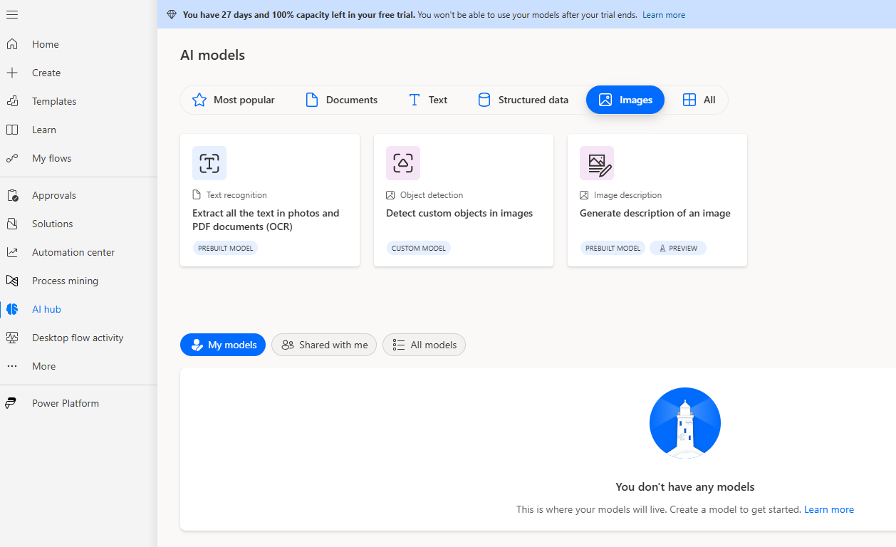

**Select Create custom model**
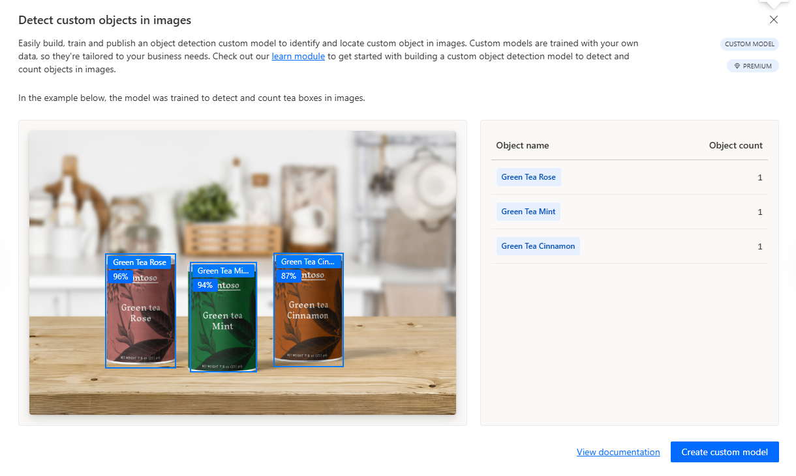

### 1.2 Select Domain

1. On the "Select domain" step, you'll see the heading **Select your model's domain**.
2. Choose the appropriate domain for your scenario:
   - **Common objects** - for general object detection
   - **Objects on retail shelves** - for retail products
   - **Brand logos** - for logo detection
3. For this lab, select **Common objects** - we will get better results than the retail products one
4. Click **Done** to proceed.

**Select our models domain**
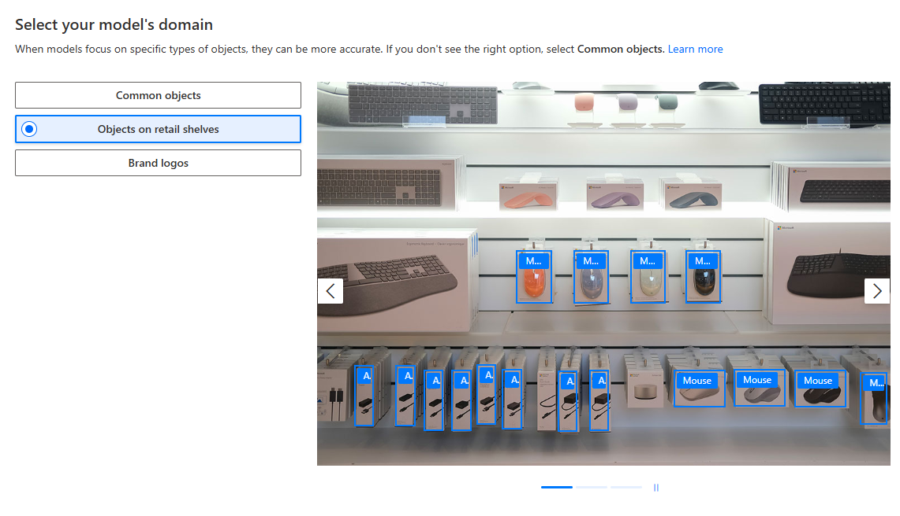

### 1.3 Choose Objects

1. You'll now see the "Choose objects" step in the wizard on the left side.
2. Give your model a name in the top right (click the "Object Detection" title to rename it): `Green Tea Detector`
   > **💡 Tip:** To ensure your model has a unique name in a shared environment, prefix it with your initials. For example, if your name is John Smith, use `JS_GreenTeaDetector` or `JS Green Tea Detector`.
3. On the "Choose objects" screen, click **+ Add object**.
4. Type: `Green Tea Rose` (for the rose-flavored green tea)
5. Click the checkmark or press Enter to add it.
6. Repeat to add more objects if needed:
   - `Green Tea Mint`
   - `Green Tea Cinnamon`
7. Click **Next** to proceed.

**Selected objects to detect**
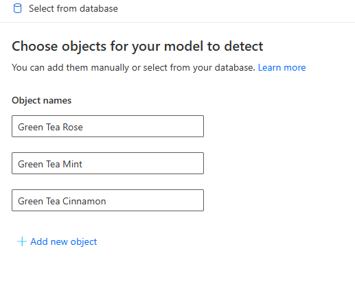

### 1.4 Add Images

1. You'll now be on the "Add images" step in the wizard.
2. Click **+ Add images** button.
3. Select at least 15-50 images containing green tea products from the **Green Tea/Train** folder.
   - **Tip:** Use diverse images with different angles, lighting, and backgrounds.
   - **Note:** Sample green tea images are available in the `Green Tea/Train` folder in this repository.
4. Wait for the images to upload.
5. Click **Next** to proceed to tagging.

**Choose images from your device**
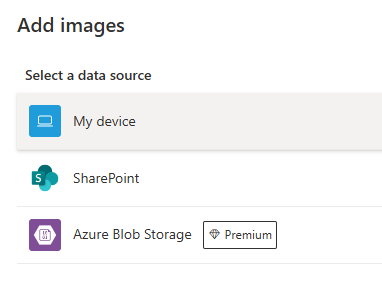

**Upload all 30 training images**
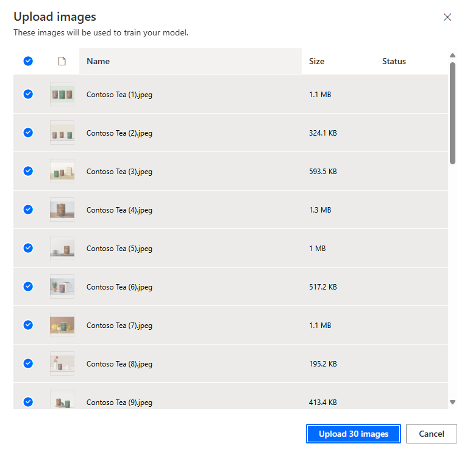

### 1.5 Tag Images

1. You'll now be on the "Tag images" step in the wizard.
2. For each image, draw bounding boxes around the green tea products:
   - Click and drag to create a box around each green tea item.
   - Select the appropriate label from the dropdown (e.g., **Green Tea Rose**, **Green Tea Mint**, **Green Tea Cinnamon**).
   - Repeat for all green tea products in the image.
3. Click the right arrow to move to the next image.
4. Continue tagging all images (you need at least 15 tagged images per object).
5. Once all images are tagged, click **Done Tagging** to proceed.

**Tagging Green Tea Mint in an image**
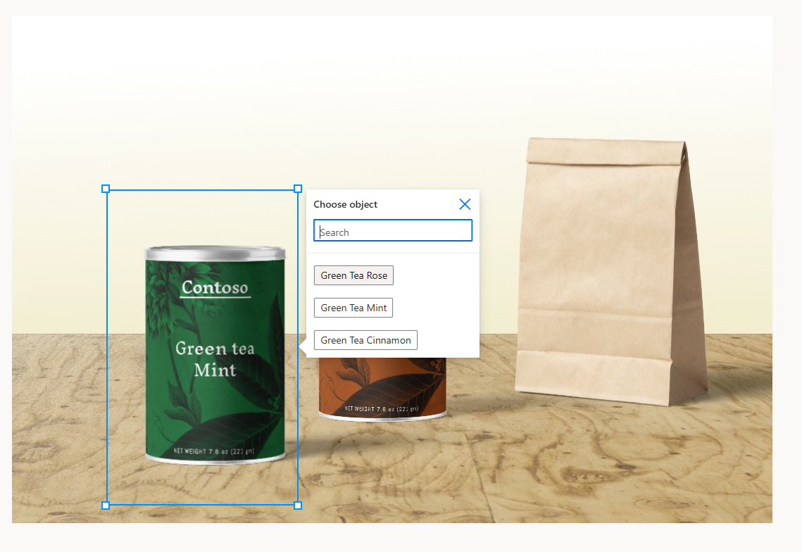

### 1.6 Model Summary and Train

1. You'll now be on the "Model summary" step in the wizard.
2. Review your model configuration:
   - Domain selected
   - Objects defined
   - Number of images uploaded and tagged
3. Click **Train** button to start training your model.
4. Wait for the training to complete (this may take several minutes to an hour).
5. Once training is complete, review the model performance metrics.

**Model summary**
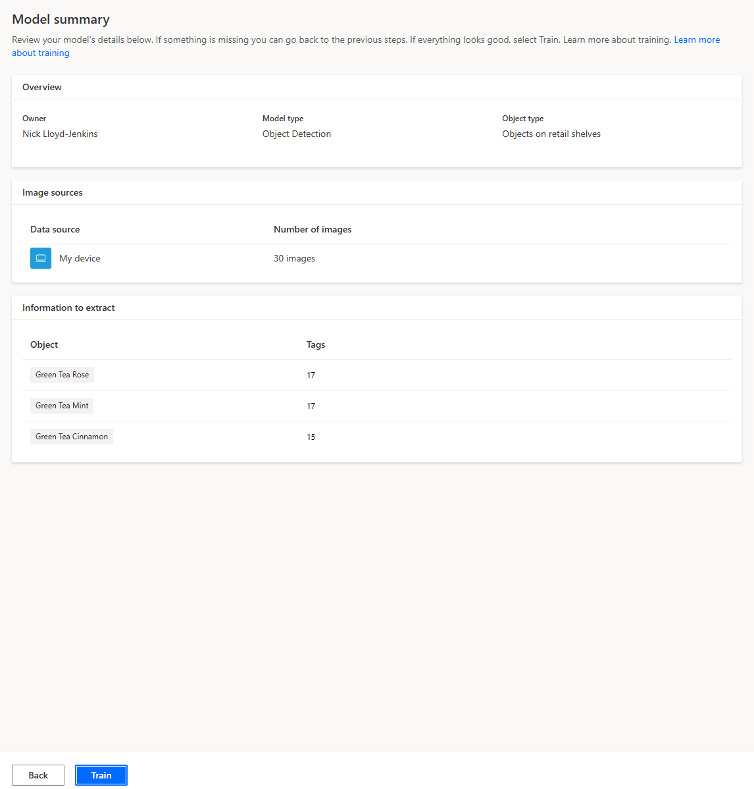

### 1.7 Test and Publish the Model

1. Click **Quick test** to test your model with a new image.
2. Upload a test image containing green tea products.
3. Review the detection results (bounding boxes and confidence scores).
4. If satisfied with the results, click **Publish**.
5. Confirm the publication.

> **Screenshot Placeholder:**  
> _Show the test results with detected green tea products._

---

## Step 2: Prepare SharePoint

### 2.1 Create a Document Library for Images

1. Open your browser and go to your SharePoint site.
2. In the left navigation, click **Site contents**.
3. Click **+ New** > **Document library**.
4. In the "Name" box, type: `Product Images`
   > **💡 Tip:** To ensure your library has a unique name in a shared environment, prefix it with your initials. For example, if your name is John Smith, use `JS_ProductImages`.
5. Click **Create**.

**Product Images Library created**
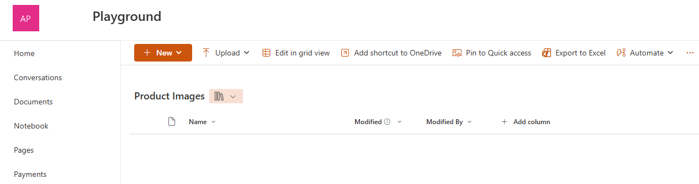

### 2.2 Create a SharePoint List for Detection Results

1. On your SharePoint site, click **Site contents** in the left navigation.
2. Click **+ New** > **List**.
3. Click **List**.
4. In the "Name" box, type: `Detection Results`
   > **💡 Tip:** To ensure your list has a unique name in a shared environment, prefix it with your initials. For example, if your name is John Smith, use `JS_DetectionResults`.
5. Click **Create**.
6. Add the following columns to the list:
   - **FileName** (Single line of text)
   - **ObjectDetected** (Single line of text)
   - **Confidence** (Number)
   - **DetectionDate** (Date and Time)
   - **ImageURL** (Hyperlink)
7. Click **Save** after each column.

**Detection Results List Created**
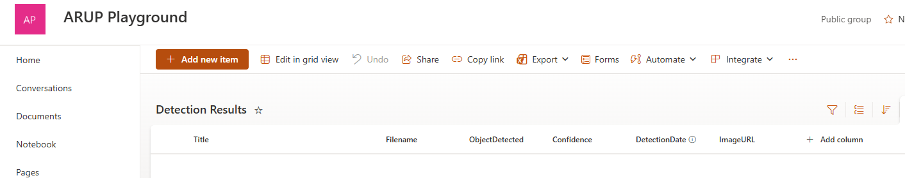

## Step 3: Create the Detection Flow

### 3.1 Start a New Flow

1. Open your browser and go to https://make.powerautomate.com.
2. On the left, click **Create**.
3. Under "Start from blank", click **Automated cloud flow**.
4. In the "Flow name" box, type: `Detect Green Tea`
   > **💡 Tip:** To ensure your flow has a unique name in a shared environment, prefix it with your initials. For example, if your name is John Smith, use `JS_DetectGreenTea`.
5. In "Choose your flow's trigger", search for:  
   `When a file is created (properties only)`
6. Click on the trigger called **When a file is created (properties only) [SharePoint]**.
7. Click **Create**.

**Create Detect Green Tea Flow**
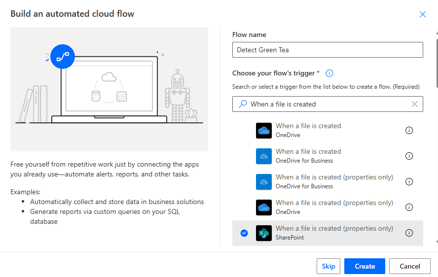

### 3.2 Configure the SharePoint Trigger

1. In the **Site Address** dropdown, select or enter your SharePoint site.
2. In the **Library Name** dropdown, select **Product Images** (or the library you created in Step 2.1).
3. Leave the rest of the settings as default.

**When a file is created trigger configured**
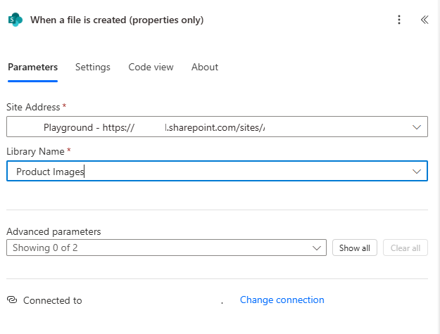

### 3.3 Add "Get file content" Action

1. Click **+ New step** or + in a circle, if using the New designer.
2. In the search box, type: `Get file content`
3. Select **Get file content [SharePoint]**.
4. In **Site Address**, select your SharePoint site (same as before).
5. In **File Identifier**, click in the box, then select **Identifier** from the Dynamic content list.

**Get file content configured**

### 3.4 Add "Detect objects in images" Action

1. Click **+ New step** or + in a circle, if using the New designer.
2. In the search box, type: `Detect objects in images`
3. Select **Detect and count objects in images** (AI Builder).
4. In **AI Model**, select your **Green Tea Detector** model from the dropdown. You may have named it differently
5. In **Image**, click in the box, then select **File content** from the Dynamic content list (from the previous "Get file content" step).
6. **Optional:** Rename this action to **Detect Green Tea** for clarity.

**Detect Green Tea configured**
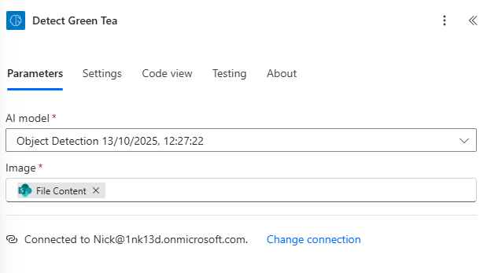

### 3.5 Add Condition to Check if Objects Were Detected

1. Click **+ New step** or + in a circle, if using the New designer.
2. In the search box, type: `Condition`
3. Select **Condition** (Control).
4. In the condition:
   - Click in the first box and select **Detected object name** from Dynamic content (from the Detect Green Tea step).
   - Set the operator to **is not equal to**.
   - In the value box, type: ""

**Condition configured**
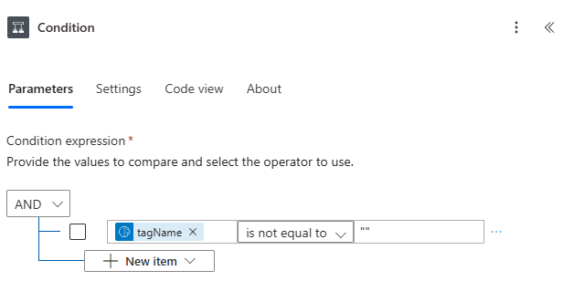

### 3.6 Add Actions in the "If yes" Branch

#### a. Add "Apply to each" Loop

1. An apply to each loop will be added for you - you don't need to do this. 

#### b. Create Item in SharePoint List (Inside the Loop)

1. Inside the "Apply to each" loop, click **Add an action**.
2. Search for **Create item**.
3. Select **Create item [SharePoint]**.
4. In **Site Address**, select your SharePoint site.
5. In **List Name**, select **Detection Results**.
6. Click **Show all** to see all fields.
7. Map the following fields:

| SharePoint Field | Value to Select from Dynamic Content                         | Notes                             |
| ---------------- | ------------------------------------------------------------ | --------------------------------- |
| Title            | **Display Name** (from Detect Green Tea)                     | The object label                  |
| FileName         | **Name** (from the trigger "When a file is created")         | Original file name                |
| ObjectDetected   | **Detected Object Name** (from Detect Green Tea)             | Should be "Green Tea" if detected |
| Confidence       | **Confidence** (from Detect Green Tea)                       | Detection confidence score        |
| DetectionDate    | Use expression: `utcNow()`                                   | Current date/time                 |
| ImageURL         | **Link to item** (from the trigger "When a file is created") | Link to the SharePoint file       |

**SharePoint Create Item configured**
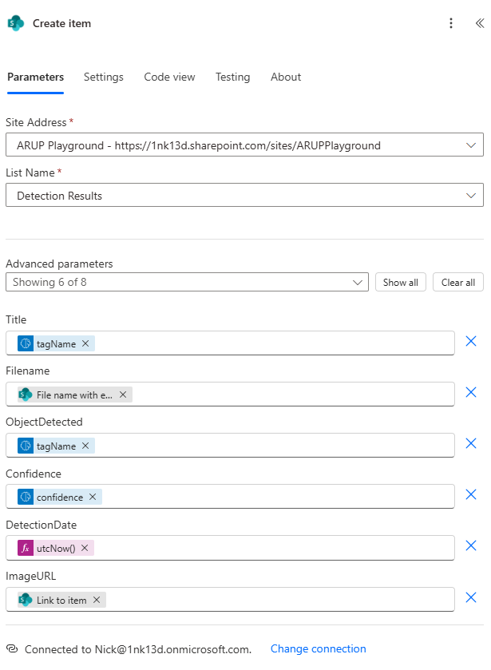

### 3.7 Add Actions in the "If no" Branch (Optional)

1. In the **If no** branch, click **Add an action**.
2. Search for **Send an email**.
3. Select **Send an email (V2)** [Office 365 Outlook].
4. Configure the email:
   - **To**: Your email address
   - **Subject**: `No Green Tea Detected - Check Image`
   - **Body**: Include the file name from Dynamic content
5. **Optional:** You can also create a list item indicating no detection.

## Step 4: Save and Test the Flow

1. In the top right, click **Save**.
2. Click **Test** (top right).
3. Choose **Manually** and click **Test**.
4. In a new browser tab, go to your SharePoint site and upload a test image containing green tea products to the **Product Images** library.
   - **Note:** Sample product images are available in this repository.
5. Return to Power Automate and watch the flow run.
6. Click on the run to see each step's output.
7. Check the detection results in the **Detect Green Tea** step to see the detected objects and confidence scores.
8. Go to your SharePoint list (**Detection Results**) and verify new items have been created for each detected green tea product.

**Flow run history**
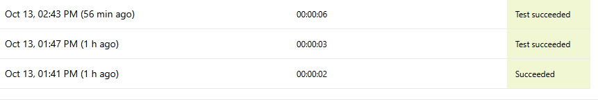

**SharePoint Detection Results List**
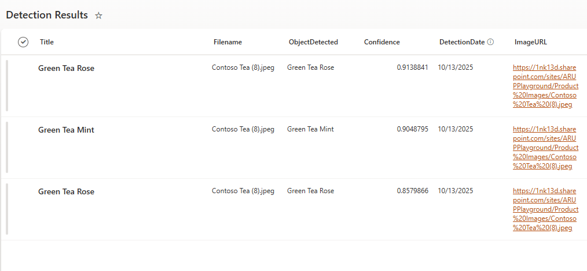

## Step 5: Enhance the Flow (Optional Improvements)

### 5.1 Add Confidence Threshold Filter

1. Modify the **Apply to each** loop to only create items for high-confidence detections.
2. Add a **Condition** inside the loop:
   - **Confidence** is greater than `0.7` (70%)
3. Only create the SharePoint item if the condition is true.

### 5.2 Add Image Thumbnail

1. Consider adding a column to store image thumbnails.
2. Use **Get file properties** action to retrieve additional file metadata.
3. Store the thumbnail URL in the SharePoint list.

### 5.3 Create Summary Email

1. After the loop, add an action to **Send an email** with a summary.
2. Include:
   - Total number of green tea products detected
   - Average confidence score
   - Link to the detection results list

> **Screenshot Placeholder:**  
> _Show enhanced flow with additional conditions and actions._

---

## Notes and Troubleshooting

- **Low detection accuracy:** Train your model with more diverse images (minimum 15-50 images recommended).
- **No objects detected:** Check that your test images contain green tea products similar to training images.
- **Model not appearing in dropdown:** Ensure your AI Builder model is published and available in the same environment.
- **Connection errors:** Verify all connections (SharePoint, AI Builder, Outlook) are authenticated.
- **Confidence scores too low:** Retrain your model with more images or better-quality training data.
- **Multiple detections of same object:** This is normal for object detection models; you may want to add logic to filter duplicates.

---

## Best Practices for Object Detection

1. **Training Images:** Use at least 15-50 images per object, with varied:

   - Angles and perspectives
   - Lighting conditions
   - Backgrounds
   - Object sizes

2. **Tagging Accuracy:** Draw bounding boxes tightly around objects without including too much background.

3. **Model Performance:** After training, test with images that weren't in the training set.

4. **Confidence Thresholds:** Set appropriate confidence thresholds based on your use case (typically 0.5-0.8).

5. **Regular Retraining:** Update your model with new images to improve accuracy over time.

---
